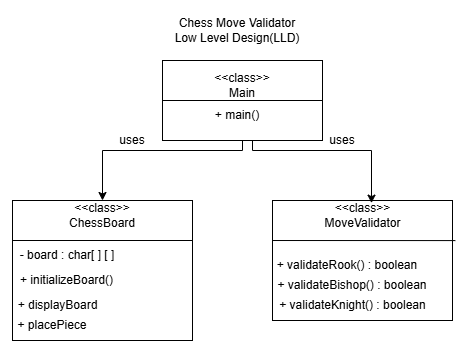

# Chess Move Validator (LLD)

## Description
A Java-based Chess Move Validator that validates the movement of Rook, Bishop, and Knight using Low Level Design (LLD).

## Technologies Used
- Java
- Object-Oriented Programming (OOP)
- Low Level Design (LLD)
- 2D Arrays
- Scanner

## Project Structure
- Main.java
- ChessBoard.java
- MoveValidator.java
- LLD_Diagram.png

## LLD Diagram

## Features
- Creates an 8×8 chess board
- Places chess pieces
- Validates Rook moves
- Validates Bishop moves
- Validates Knight moves
- Displays valid or invalid move

## Author
Sunfiya J
